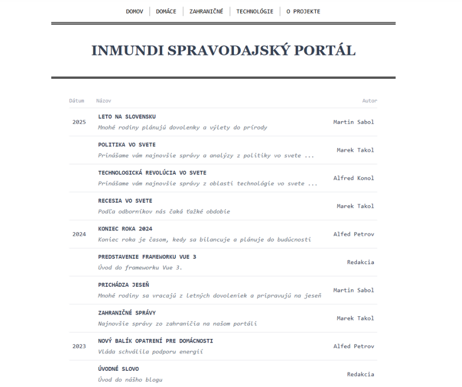

# inmundi - Nuxt Content projekt

Toto je Ukážkový Nuxt Content projekt

## Ukážkový obrázok aplikácie

### O projekte

#### Použité technológie:

- Nuxt.js
- Nuxt Content
- Vue.js
- TypeScript
- Markdown Syntax
- Javascript
- TailwindCSS

## Inštalácia

### `npm install`

Nainštaluje všetky potrebné závislosti pre projekt.

### `npm run dev`

Spustí vývojový server Nuxt.js.\
Otvorte [http://localhost:3000](http://localhost:3000) vo vašom prehliadači.
Stránka sa automaticky obnoví pri každej zmene kódu.

### `npm run build`

Vytvorí produkčnú verziu aplikácie v priečinku `.nuxt`.\
Optimalizuje aplikáciu pre najlepší výkon.
